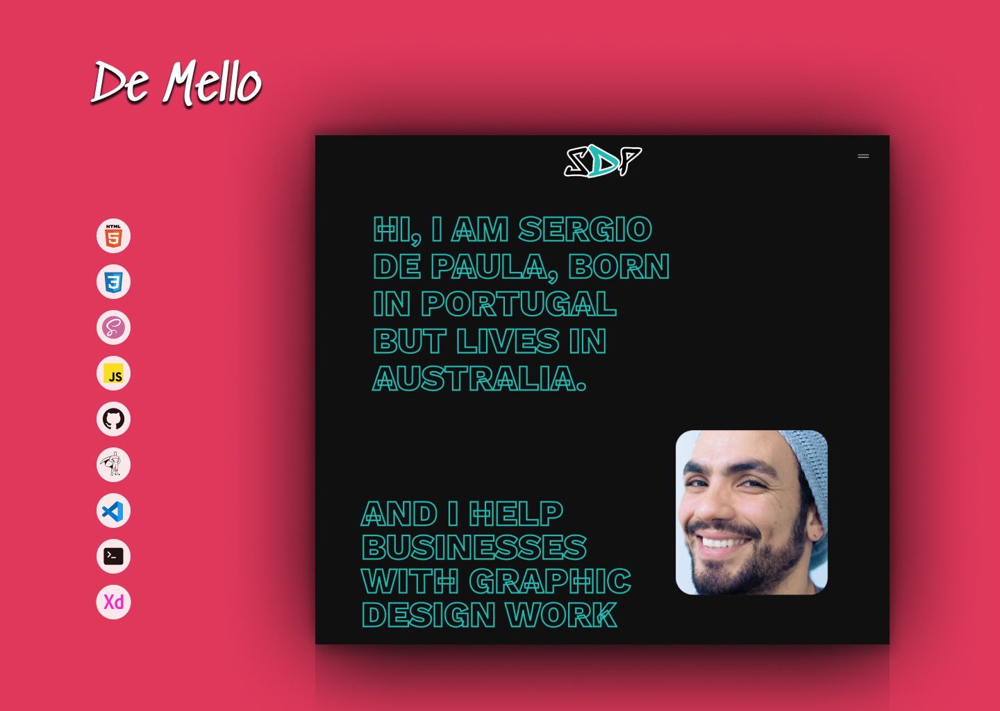
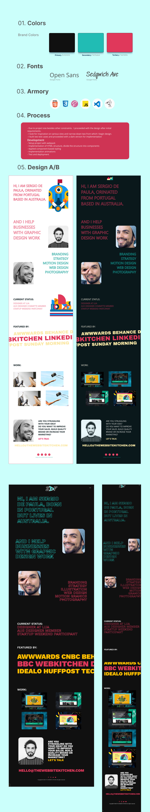

### Sergio De Mallo---Website

<br />
<p align="center">
  <a href="https://m90khan.github.io/designer-paula/">
    
  </a>

  <h3 align="center">Sergio De Mallo---Website  </h3>

  <p align="center">
Designer Portfolio <br />
    <a href="m90khan@gmail.com"><strong>Contact Me</strong></a>
    <br />
    <br />
    <a href="https://m90khan.github.io/designer-paula/">View Demo</a>
    
   </p>
</p>

## Table of Contents

- [About the Project](#about-the-project)
- [Process](#process)
- [Skills](#skills)
- [Code Snipet](#code)
- [Contact](#Contact)

---

### About the Project

- It is an designer portfolio from design to development.

Live: https://m90khan.github.io/designer-paula/
Layout: Flexbox (BEM Model)
Duration: 14 hrs - 2 days split


#### Process

- Due to project size besides other constraints. I proceeded with the design after initial requirements.
- I look for inspiration on various sites and narrow down two from which I begin design.
- I built two test cases and proceeded with a dark version for implementation

# Development

- Setup project with webpack
- Implementation of HTML structure, divide the structure into components
- Applied component-based styling
- Implementation animations
- Test and deployment



---

### Skills

[][youtube]
[][youtube]
[][youtube]
[][youtube]
[][youtube]
[][youtube]
[][youtube]
[][youtube]
[][youtube]
<br />
<br />

---

### Code Snippet

```javascript
function playAudio(e) {
  e.preventDefault();
  if (!playBtn.classList.contains('active')) {
    playBtn.classList.add('active');
    play.play();
    playBtn.innerText = 'Stop';
    gsap.set([heading, '.heading'], {
      duration: 2,
      webkitTextFillColor: '#21bdb4',
      stagger: 1,
    });
  } else {
    playBtn.classList.remove('active');
    playBtn.innerText = 'Play';
    play.currentTime = 0;
    gsap.set([heading, '.heading'], {
      duration: 2,
      webkitTextFillColor: 'transparent',
      stagger: 1,
    });
    play.pause();
  }
}
```

---

### Connect with me:

[][youtube]

[][twitter]
[][linkedin]
[][instagram]
[][behance]
[][dribble]
<br />

---

[youtube]: https://www.youtube.com/channel/UC96rVfdTKsjZpREnH6CaCOw
[twitter]: https://twitter.com/m90khan
[linkedin]: www.linkedin.com/in/uxdkhan
[instagram]: https://www.instagram.com/uxd.khan/
[behance]: https://www.behance.net/Khan_Mohsin
[dribble]: https://dribbble.com/uxdkhan
